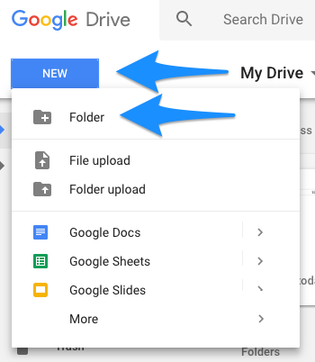
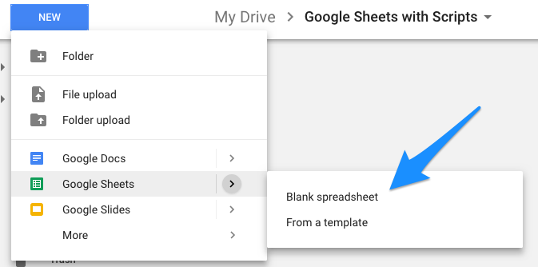
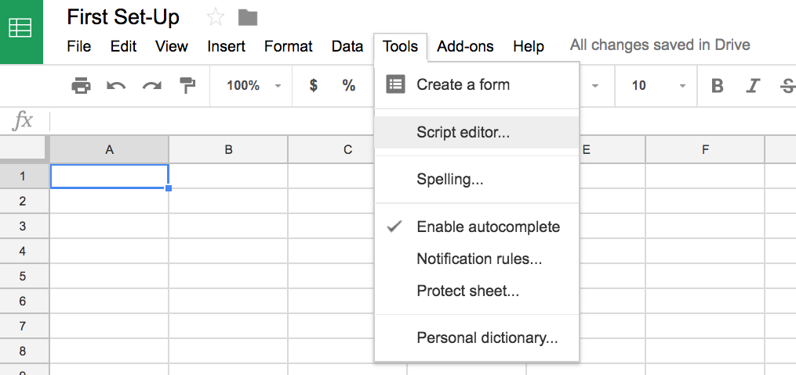

## Hacking Google

### Overview

Today, we will introducing student to to Google Apps Script which can be used to extend the capabilities of G Suite products.  We will be focusing primarily on creating scripts to interact with Google Sheets.  

##### Instructor Priorities/Prior Knowledge Requirements

* Student should have a google account and be familiar with Google Drive.  
* Students should have a basic understanding of javascript functions and loops.

##### Instructor Notes

* Needs editing

- - -

### Objectives

* To introduce students to the capabilities of using Google Apps Script to create macros, custom functions, and charts in 
Google Sheets. 
* 

- - - 

### 1. Instructor Do: Welcome Students (0:01)

* Take a minute to welcome students and see how they are doing while opening [Introduction to Google Apps Script](https://docs.google.com/presentation/d/1ynneIPznmbAwAoNVCto-vulT6IBh7p8fueSiiWtuYN8/edit?usp=sharing).

### 2. Instructor Do: Introduction Google Apps Script (0.03)

* Explain to 

### 3. Everyone Do: Getting Set Up (0:03)

This first activity is to familarize students with creating a container-bound script in Google Sheets.  Have student sign into their Google Drive account by going to to https://www.google.com/drive/.  Once they are signed into google drive have them make a new folder to hold the Google Sheets for this lesson.  

Once inside this Folder have them add a new Google Sheet by choosing `NEW > Google Sheets > Blank spreadsheet`.

* The Script Editor is found by going to the `Tools` menu and choosing `Script Editor...`.  

