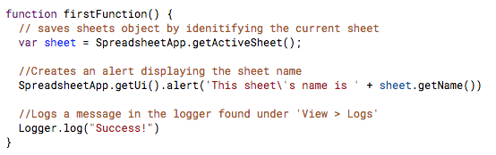
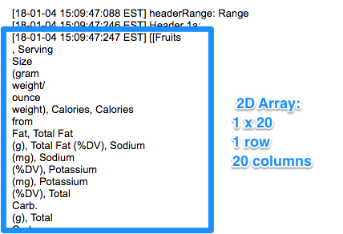
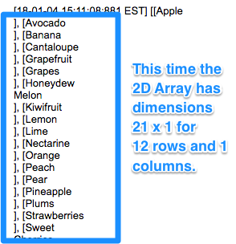
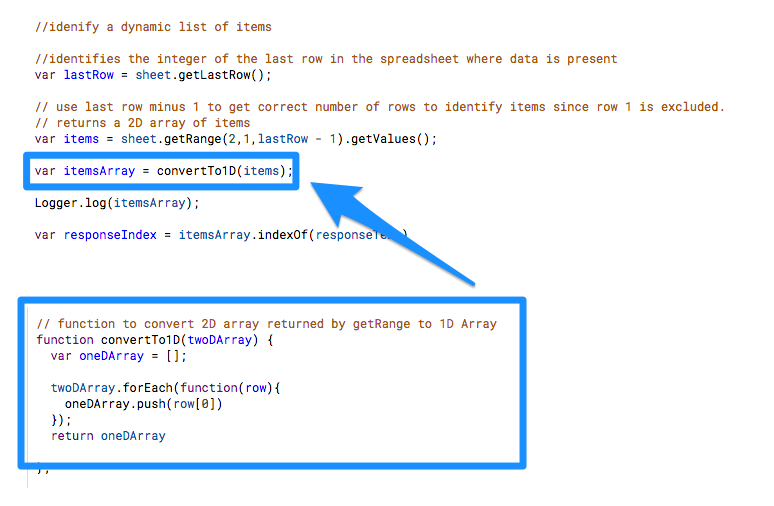
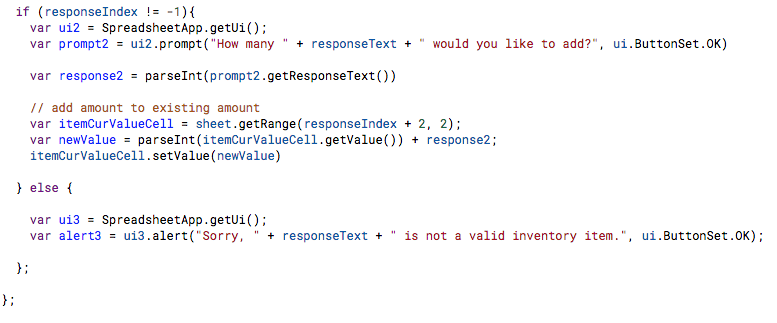
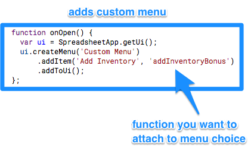

## Hacking Google

### Overview

Today, we will introducing student to to Google Apps Script which can be used to extend the capabilities of G Suite products.  We will be focusing primarily on creating scripts to interact with Google Sheets.  

##### Instructor Priorities

* Students should be able to apply methods specific to Google Apps Script to manipulate a Google Sheets file and create a new event.  
* Students should complete `03-Stu_PixelArt`.
* Students should complete `04-Stu_OfficeInventory_PartII`
* Students should complete `05-Stu_EmbeddingCharts`

##### Instructor Notes

__Prior KNowledge Requirements:__
* Student should have a google account and be familiar with Google Drive.  
* Students should have a basic understanding of javascript functions, variables, conditionals, and loops.

* Today, students will use their knowledge of javascript to use Google Apps Script to interact with a Google Sheets file.
* Google Apps script is javascript based but they provide some of their own classes and methods which can be found at 
https://developers.google.com/apps-script/reference/.
* Google Apps Script is a helpful skill to know, especially when your data is automatically being pumped there from a Google Form or some other third party service.
*  The learning curve for Google Apps Script is not that steep due to Google's clear reference.  Learning just a few custom methods allows students to dig deeper and incorporate more advanced functions rather quickly.  

- - -

### Objectives

* To introduce students to the capabilities of using Google Apps Script to create macros, menus, dialogs, and charts in 
Google Sheets. 
* To have students become proficient in controling a Google Sheet programatically.  

- - - 

### 1. Instructor Do: Welcome Students (0:01)

* Take a minute to welcome students and see how they are doing while opening [Introduction to Google Apps Script](https://docs.google.com/presentation/d/1ynneIPznmbAwAoNVCto-vulT6IBh7p8fueSiiWtuYN8/edit?usp=sharing).

### 2. Instructor Do: Introduction Google Apps Script (0.03)

* Explain to 

### 3. Everyone Do: Getting Set Up (0:03)

Have students follow along with this first activity to familarize them with creating a container-bound script in Google Sheets and setting the correct permissions.  

Have student sign into their Google Drive account by going to to https://www.google.com/drive/.  Once they are signed into google drive have them make a new folder to hold the Google Sheets for this lesson.  

Once inside this Folder have them add a new Google Sheet by choosing `NEW > Google Sheets > Blank spreadsheet`.

Students will want to click on the Title of the Spreadsheet currently reading `Untitled spreadsheet` and rename to a title of their chosing.  Explain to student who are unfamilar with G Suite Applications that all changes are immediately saved.  

The Script Editor is found by going to the `Tools` menu and choosing `Script Editor...`.  

Slack out [01-Evr_SetUpScript.gs](https://github.com/racquesta/sampleLesson/blob/master/Activities/01-Evr_SetUpScript/01-Erv_setUpScript.gs) to students, and have them copy and paste the script into their Google script editor, give the script a new name, save, and run the script either by pressing the  or choosing `Run > Run function > Function Name`. 

Generally, the first time a new script is run inside a Google App, it will require authorization.  Students can complete this process by:

  1. Clicking `Review Permissions` in the Authorization required window.
  
  
  
  2. Choosing the google account they are currently using.
  
  
  
  3. Clicking the `Advanced` link.  
  
  
  
  4. Scrolling down and clicking the link that reads `Go to (script name)(unsafe)`.
  
  

  5. Choosing `Allow`.
  
__Note important parts of the code for students:__

* The first line of the function required to identify the current sheet so that we may interact with it.  `SpreadsheetApp ` is the parent class for Google's spreadsheet service and allows us to access the `getActiveSheet` method which sets the current sheet in the Spreadsheet. 

* The `getUi` method returns an instance of the spreadsheets user inferface and allos us to add menus, dialogs, and sidebars.

* The `Logger` class is similar to the console in javascript.  It allows us to write out or retrieve text from the the debugging log.  The log can be found by going to `Views > Logs`.

* Slack out the following Google Apps Script Spreadsheet Reference link to students: https://developers.google.com/apps-script/reference/spreadsheet/

### 4. Instructor Do: Cells and Ranges
 
Open and slack out the following link to students so they may follow along with the code: https://docs.google.com/spreadsheets/d/1pLszOnk7HanYVpFPMcdpfOuobDuHcA2oS7-aLvytq9Q/copy (Note: This link will force the user to make a copy.)

This spreadsheet contains 5 functions with the goal of familiarizing students with retrieving and manipulating different attributes of cells.  

Unlike javascript, you cannot call multiple functions by running one .gs file.  Instead, you must choose a function to run in one of two ways:

* From the `Run` menu, choose  `Run function` and choose the function you would like run.

* From the  after selecting your desired function from the dropdown.  

If you desire to run several functions from one script, you must call them from inside the function you choose.

1. The first function covers several ways to indentify a range of cells with Google Apps Script.  

* Note that the method `getRange()` only returns an instance of the range class, but does not return the values contained in that range.  This object can be chained with `.getValues()` to return a *2D array of values*.

* The syntax for the second `getRange()` method is `getRange(rowCoordinate, columnCoordinate, Number of Rows, Number of Columns)` and will return the range with the top left cell at the given coordinates with the given number of rows and columns.

 

2. The `getColumn` function returns a list of the fruits from the first column excluding the header row.  Note the structure of the 2D Array for students.  Each row is a separate array within the array while column values are the values held in that inner array.  

 

3.  The `retrieveAllData()` function returns a 2D array holding all of the data in the sheet.

4. Both the `writeCellsAndRanges()` and `newData()` functions enable us to write data to the sheet.  The first retrieving and editing data from the sheet, and then writing it back to the same cell, and the later writing an entire range of new data to the sheet.  

* Note for students that the range indentified must match dimensions of the new data or an error will be returned.  Due to this, the new data array must be a 2D array.  

* An alternative to this method is to loop through both the desired range cell by cell and an array while assigning the cells the correct array index value.  

 

5. Let students know that in this activity we were mostly working with sheet and range classes, and available methods for both can be found in the Google Apps Script Reference at https://developers.google.com/apps-script/reference/spreadsheet/sheet and https://developers.google.com/apps-script/reference/spreadsheet/range respectively.  You may want to slack out these links as the next activity will depend on them identifying methods from both.  

### 5. Students Do: Pixel Art

Open the Google Sheets file at the provided link, and run the code to demonstrate the solution to students. 

__Slack out the Instructions to students: [03-Stu_PixelArt Instructions]__
(https://github.com/racquesta/sampleLesson/blob/master/Activities/03-Stu_PixelArt/Instructions.md)

Google Sheets File : https://docs.google.com/spreadsheets/d/1k3SnVr-ghBhsfBYd1n1v0aG7XgGMwA9Cpnge4CYDrWQ/copy 

1. Open the Google Sheets file at the provided link, make a copy in your Google Drive, and open the Script Editor.  

2. Color the Pixel Art Face using colors of your choosing.  Some hexidecimal color codes are provided should you want to use them.  Otherwise, a simple google search for the color you are looking for or a visit to http://cloford.com/resources/colours/500col.htm will do.  

3. Assign at least two cells character values (strings or ints).  This can be incorporated into your art or be a title given at the bottom.  

Bonus:  Create an additional function that returns the spreadsheet to its original state.  

Hint:  You may want to incorporate javascript conditionals and/or loops to make your code more efficient.  

### 6. Instructor Do: Review: Pixel Art

While going over the [Pixel Art Solution](link) with students, ask student for suggestions of how they completed their code.  

Be sure to highlight the use of a nested loop if you feel it is necessary for your students.  

Go over the Bonus solution.

### 7. Instructor Do: Keeping Inventory Part 1

In this activity, we will be making use of Google's ui class to make dialogs that allow us to interact with the script.  We will be creating a simple interface that allows us to add inventory to a list.  Note that in this activity we will be incorporating more basic javascript into our code.  

Open the [02-Ins_KeepingInventory]() Google Sheet and script and walk through code with students: https://docs.google.com/spreadsheets/d/1izJAXW77oYjh2MPspuGUjirxJ2ZViJfztjcMbhi2Dwk/copy

1. We need to create the instance of the sheet class as always.  Then, we create an instance of the ui class by using `getUi()`.  The ui class instance is then chained with the `.prompt` method which has been given the parameters (title, prompt text, and a button set). We then save the response in the variable `responseText`.

2. Then, we turn our attention to getting the current inventory items from the sheet to compare against the response.  We use a method similar to the last example.  Since, the values in the range return as a 2D Array, we use another function to 'flatten' it into a 1D Array.  This allows us to find the index of the identified item using javascript's `indexOf` method.

3. We then use the index of the response item to determine whether or not the item is in inventory.  If it is, we prompt the user for a value to add, and if not, we alert the user that the item is not in inventory.  

### 8. Students Do: Keeping Inventory Part II

In this activity, students will be editing the [04-OfficeInventory](https://github.com/racquesta/sampleLesson/blob/master/Activities/04-Ins_InvControl_Part1/addInventory.gs) script to return a different alert if the item is not in ventory.  

Slack out the [Instructions](https://github.com/racquesta/sampleLesson/blob/master/Activities/05-Stu_InvControl_Part2/Instructions.md) to Students: 

Oh no!  The current inventory interface is not very friendly and does not offer the ability to add new items to the list.  Open the speadsheet at https://docs.google.com/spreadsheets/d/1izJAXW77oYjh2MPspuGUjirxJ2ZViJfztjcMbhi2Dwk/copy and alter the script to do the following.

1. If the item is not in inventory, alert the user that this is the case, and ask then to check their spelling.  (You might even want to eliminate the case-sensitivity.)  

2. In the same alert, allow the user to press YES to add the the item to the inventory list, and NO to cancel.  

3.  Collect the response to the alert, and if the user responded with YES, add the item to the list.  Then, prompt the user to give a value, and add it to the appropriate place.

BONUS: 
* Add a custom menu or sidebar that will run your script.

* Utilize a function to create prompts to retrieve a user input for item amount.  Use that function for each time a number input is needed.  

Hints:  

* Utilize the google apps scripts reference section for additional ideas and help with available methods.

### 9. Instructor Do:  Review: Keeping Inventory Part II

Open the [04-InvControl_Part2 Solution Code](https://github.com/racquesta/sampleLesson/blob/master/Activities/05-Stu_InvControl_Part2/Solved/addInventory_solved.gs) or the [Solution Spreadsheet](https://docs.google.com/spreadsheets/d/1izJAXW77oYjh2MPspuGUjirxJ2ZViJfztjcMbhi2Dwk/copy) and open the ScriptEditor.

Ask students to go over the additions to the code, and explain what each does.  

Ask students whether they completed the bonus code.  Ask them to share their solution.  Show the ability to create a custom  menu if no student goes over it.  The bonus code can be found [here] and in the script editor.  You will have to choose `bonus.gs` from the left menu.  *Note: You can access functions and variables from other code files within a google speadsheet.*

[Bonus Solution Code](https://github.com/racquesta/sampleLesson/blob/master/Activities/05-Stu_InvControl_Part2/Solved/addInventory_bonus.gs)

`onOpen` is a reserved function name in Google that allows you to set s simple trigger.  In this case, on open a custom menu will be added.  

### 10.  Instructor Do:  Charting Calories

This activity is to assimilate students with using Google's chart builder feature.  

Go over the code for students or have them talk briefly to each other about what they think the code does and how it works as a class.  

There are a couple things to highlight in this code:

1. We create an instance of the entire spreadsheet this time as we will be adding a sheet.  

2. Identify the ranges dynamatically by finding `lastRow `, and save those ranges as variables.    

3. We build the chart in the `chartBuilder` variable and then in order for the chart to appear we must call `.build()` on it, and then add to to the correct sheet.  

### 11. Pairs Do: Troubleshooting Chart Updates

Slack out the speadsheet link to students.  Explain the directions below.    

A programatically created chart is really no good if it doesn't have the ability to update with new data.  Alter the code so that the graph updates upon running the function.  

### 12.  Instructor Do: Review: Troubleshooting Chart Updates

Ask for volunteers to go over how they solve the problem above.  Use the below code only if needed.  

### 13.  CHALLENGE

