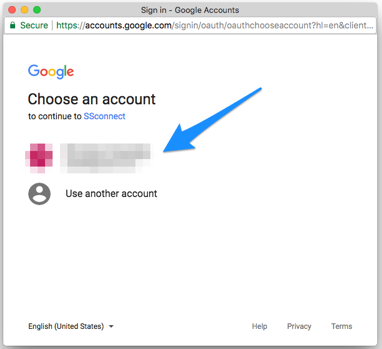

## Hacking Google

### Overview

Today, we will introducing student to to Google Apps Script which can be used to extend the capabilities of G Suite products.  We will be focusing primarily on creating scripts to interact with Google Sheets.  

##### Instructor Priorities/Prior Knowledge Requirements

* Student should have a google account and be familiar with Google Drive.  
* Students should have a basic understanding of javascript functions, variables, conditionals, and loops.

##### Instructor Notes

* Needs editing

- - -

### Objectives

* To introduce students to the capabilities of using Google Apps Script to create macros, custom functions, and charts in 
Google Sheets. 
* 

- - - 

### 1. Instructor Do: Welcome Students (0:01)

* Take a minute to welcome students and see how they are doing while opening [Introduction to Google Apps Script](https://docs.google.com/presentation/d/1ynneIPznmbAwAoNVCto-vulT6IBh7p8fueSiiWtuYN8/edit?usp=sharing).

### 2. Instructor Do: Introduction Google Apps Script (0.03)

* Explain to 

### 3. Everyone Do: Getting Set Up (0:03)

Have students follow along with this first activity to familarize them with creating a container-bound script in Google Sheets and setting the correct permissions.  

Have student sign into their Google Drive account by going to to https://www.google.com/drive/.  Once they are signed into google drive have them make a new folder to hold the Google Sheets for this lesson.  

Once inside this Folder have them add a new Google Sheet by choosing `NEW > Google Sheets > Blank spreadsheet`.

Students will want to click on the Title of the Spreadsheet currently reading `Untitled spreadsheet` and rename to a title of their chosing.  Explain to student who are unfamilar with G Suite Applications that all changes are immediately saved.  

The Script Editor is found by going to the `Tools` menu and choosing `Script Editor...`.  

Slack out [01-Evr_SetUpScript.gs](https://github.com/racquesta/sampleLesson/blob/master/Activities/01-Evr_SetUpScript/01-Erv_setUpScript.gs) to students, and have them copy and paste the script into their Google script editor, give the script a new name, save, and run the script either by pressing the  or choosing `Run > Run function > Function Name`.  

Generally, the first time a new script is run inside a Google App, it will require authorization.  Students can complete this process by:

  1. Clicking `Review Permissions` in the Authorization required window.
  
  
  2. Choosing the google account they are currently using.
  
  
  3. Clicking the `Advanced` link.  
  
  
  4. Scrolling down and clicking the link that reads `Go to (script name)(unsafe)`.
  

  5. Choosing `Allow`.
  
Note important parts of this code for students:

* The first line of the function required to identify the current sheet so that we may interact with it.  `SpreadsheetApp ` is the parent class for Google's spreadsheet service and allows us to access the `getActiveSheet` method which sets the current sheet in the Spreadsheet. 

* The `getUi` method returns an instance of the spreadsheets user inferface and allos us to add menus, dialogs, and sidebars.

* The `Logger` class is similar to the console in javascript.  It allows us to write out or retrieve text from the the debugging log.  The log can be found by going to `Views > Logs`.

[Google Apps Script - Spreadsheet Reference](https://developers.google.com/apps-script/reference/spreadsheet/)

